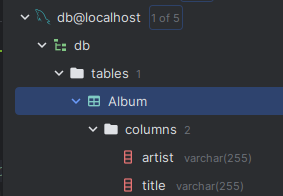

Ціль: отримати дані з таблиці та відобразити її за добомою var_dump в вікні index

Опорна линка:
* https://docs.laminas.dev/tutorials/getting-started/database-and-models/

Таблиця автоматично створюется коли створюется контейнер тому що він запускае скрипт SQl котрий створюе її та наповнюе даними
https://onexlab-io.medium.com/docker-compose-mysql-entry-point-fa6335346791

Коли створюется з точку входу щось це займае час, тому не слід спішити

Понятя моделі з MVC паттерна
* https://developer.mozilla.org/en-US/docs/Glossary/MVC
* https://www.freecodecamp.org/news/the-model-view-controller-pattern-mvc-architecture-and-frameworks-explained/
* https://doka.guide/js/architecture-mvc/

AlbumTable - обгортка для виконання запитів в таблицю альбому
TableGateway - типо як репозиторій

Практика:

* Встановлення через composer (composer require laminas/laminas-db) пакету Laminas для взаемодії з базою данних 
* Створення власної моделі
_ exchangeArray() потрібен щоб дані отримані з бази данних 
* Створити та додати AlbumTable з фабрикою
* Створити та додати AlbumTableGateway з фабрикою
* Додати конфіг для підключення к базі даних
* Додати через фабрику контроллера модуль Альбома до контроллера
* Усе (фабрики та сутності) потрібно додати до конфіг файлу (він е точкою збірки)
* Вибрати усі альбоми да видати їх в index action
* Оновити index шаблон для відображення усіх альбомів

Результат

пс. додам пизже

додаткова практика з PDO
* Приклад https://github.com/devlubinets/php/blob/master/src/pdo/pdo-test-connection.php
* Документація по PDO https://www.php.net/manual/en/book.pdo.php
* (приклад) Гарний приклад роботи з PDO https://www.w3schools.com/php/php_mysql_connect.asp
* (гайд) Стркутурований гайд https://www.phptutorial.net/php-pdo/
* (гайд) Старий гарний сайт з докою на тему https://phpdelusions.net/pdo